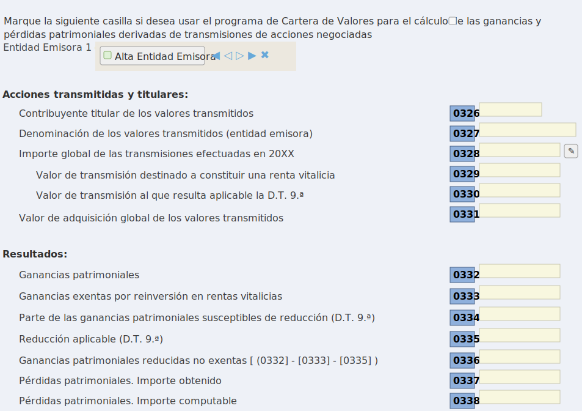
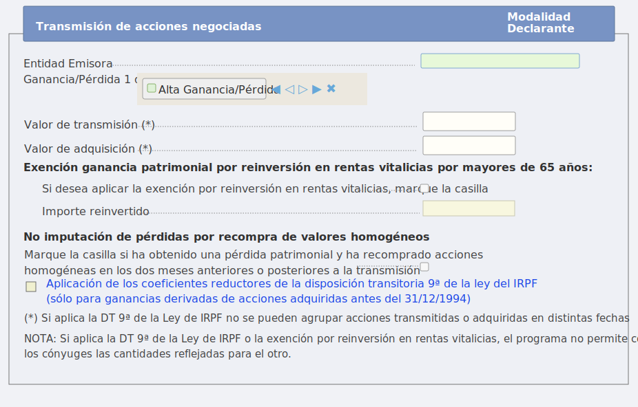

<div align="center">

# RentaDegiro

### Prepara Renta WEB desde tus CSV de DEGIRO, con FIFO, regla de los 2 meses y Excel revisable

FIFO · Regla de recompra · Líneas F2 · Control 0339/0340 · Markdown + Excel

[](https://www.gnu.org/licenses/gpl-3.0)
[](https://www.python.org/)
[](docs/usage.md#salidas)
[](docs/usage.md#salidas)

[](https://github.com/sponsors/flaviogrillo1)
[](https://buymeacoffee.com/flaviogrillo)
[](https://donate.stripe.com/6oUeVebYc4Tc8sMgVqbbG00)

</div>

> Proyecto no oficial. No está afiliado, aprobado ni respaldado por DEGIRO, flatexDEGIRO Bank AG, la Agencia Tributaria ni ninguna administración pública.

RentaDegiro convierte `Transactions.csv` y `Account.csv` de DEGIRO en un informe pensado para declarar ventas de acciones en Renta WEB. Te dice qué líneas introducir, qué importes copiar, cuándo marcar el check de recompra de valores homogéneos y qué cifras deberían cuadrar en las casillas 0339/0340.

La regla práctica del proyecto es sencilla: si consigues generar el informe, revisar las alertas y trasladar los datos con menos esfuerzo o menos riesgo de error, el flujo termina apoyando el mantenimiento con una donación.

## Para quién es

Úsalo si:

- operas acciones con DEGIRO y tienes que preparar el apartado F2 de Renta WEB;
- necesitas reconstruir FIFO por ISIN;
- quieres detectar pérdidas afectadas por la regla de recompra de 2 meses;
- quieres un Excel operativo para copiar datos y revisar el cuadre.

No es la herramienta adecuada si tu caso depende principalmente de ETFs, fondos, cripto, opciones, futuros, CFDs, ventas en corto o eventos corporativos complejos. Revisa [limitaciones y checklist](docs/limitations.md) antes de presentar.

## Resultado esperado

El objetivo no es sustituir a Renta WEB ni a un asesor fiscal. El objetivo es que llegues a este punto:

1. Tienes los CSV originales de DEGIRO.
2. Generas un Markdown y un Excel.
3. Revisas alertas, FIFO incompleto, recompra 2M y eventos raros.
4. Copias las líneas F2 en Renta WEB.
5. Compruebas que el control 0339/0340 cuadra razonablemente.
6. Si el informe te ha ahorrado tiempo, errores o una revisión manual pesada, haces una donación.

## Uso rápido

Requisitos:

- Python 3.11 o superior.
- `Transactions.csv` y `Account.csv` exportados desde DEGIRO.
- Historial suficiente para cubrir compras antiguas y recompras posteriores.

Comando recomendado para IRPF 2025:

```bash
python main.py --transactions Transactions.csv --account Account.csv --year 2025 --output informe_irpf_2025.md --excel-output informe_irpf_2025.xlsx --fx-mode degiro --history-end-date 2026-02-28
```

Si no indicas `--excel-output`, el script genera automáticamente un Excel con el mismo nombre base que el Markdown.

## Qué devuelve

- `informe_irpf_2025.md`: explicación legible, resumen ejecutivo, líneas F2, checks 2M, control de casillas, pérdidas diferidas, compensaciones y alertas.
- `informe_irpf_2025.xlsx`: pestañas operativas para trabajar en Renta WEB sin perder el rastro de cada cifra.

Las pestañas clave son:

| Pestaña | Para qué sirve |
|---|---|
| `02 Renta WEB` | Líneas que normalmente copiarás en Renta WEB |
| `03 Checks 2M` | Ventas donde debes revisar la regla de recompra |
| `04 Control Renta WEB` | Cuadre agregado con 0339/0340 |
| `09 Alertas` | Riesgos que conviene resolver antes de presentar |
| `10 Resumen final` | Bloque corto para repasar el resultado |

## Cómo se usa en la práctica

1. Exporta `Transactions.csv` y `Account.csv` desde DEGIRO.
2. Ejecuta el comando recomendado.
3. Abre primero `09 Alertas` y `04 Control Renta WEB`.
4. Si hay FIFO incompleto o el mismo ISIN en otro broker, corrige el histórico antes de usar el resultado.
5. Copia en Renta WEB las líneas de `02 Renta WEB`.
6. Marca el check de recompra solo cuando el informe indique `SÍ`.
7. Conserva CSV, Markdown y Excel como soporte de revisión.
8. Si el informe te ha servido, dona para mantener el proyecto.

## Demo local

Puedes revisar una demo anonimizada completa sin salir del repo:

- [CSV de operaciones](examples/demo_transactions.csv)
- [CSV de cuenta](examples/demo_account.csv)
- [Informe Markdown generado](examples/informe_demo.md)
- [Informe Excel generado](examples/informe_demo.xlsx)

La demo visual está centrada en ventas de acciones para Renta WEB. El script también calcula dividendos, intereses, retenciones y compensaciones, pero esa parte debe revisarse como apoyo, no como sustituto del cálculo final de Renta WEB.

### Pantalla de Renta WEB: resumen de transmisiones



### Pantalla de Renta WEB: alta de transmisión



Ver explicación completa en [Cómo trasladar los datos a Renta WEB](docs/renta-web.md).

## Apoya el proyecto

RentaDegiro existe para ahorrar horas de revisión manual en una parte especialmente incómoda de la declaración. Si te ha ayudado a generar tu informe, detectar un error o preparar Renta WEB con más confianza, la forma correcta de cerrar el proceso es apoyar su mantenimiento:

<p align="center">
  <a href="https://buymeacoffee.com/flaviogrillo">
    
  </a>
</p>

<p align="center">
  <a href="https://donate.stripe.com/6oUeVebYc4Tc8sMgVqbbG00">
    
  </a>
</p>

- [GitHub Sponsors](https://github.com/sponsors/flaviogrillo1)
- [Buy Me a Coffee](https://buymeacoffee.com/flaviogrillo)
- [Stripe](https://donate.stripe.com/6oUeVebYc4Tc8sMgVqbbG00)

## Documentación

Lee estos documentos en este orden:

1. [Uso y argumentos](docs/usage.md)
2. [Cómo trasladar los datos a Renta WEB](docs/renta-web.md)
3. [Limitaciones, errores frecuentes y checklist](docs/limitations.md)
4. [Reglas fiscales y criterios](docs/fiscal-rules.md)
5. [Ejemplos y demo](docs/examples.md)

## Fuentes oficiales

La base normativa principal es la Ley 35/2006 del IRPF, artículos 33.5 y 37.2.

- [Ley 35/2006 del IRPF - BOE](https://www.boe.es/buscar/act.php?id=BOE-A-2006-20764)
- [AEAT - valores homogéneos](https://sede.agenciatributaria.gob.es/Sede/ayuda/manuales-videos-folletos/manuales-ayuda-presentacion/cartera-valores/2-valores-homogeneos.html)
- [AEAT - Renta WEB F2](https://sede.agenciatributaria.gob.es/Sede/Ayuda/24Presentacion/100/7_6_6_2/ganancias_perdidas_patrimoniales_derivadas_acciones.html)

La AEAT indica que las pérdidas afectadas por recompra deben declararse y cuantificarse aunque no se integren cuando corresponde, dentro del apartado F2 de ganancias y pérdidas patrimoniales.

## Disclaimer

Esta herramienta es de apoyo. No sustituye a Renta WEB ni a un asesor fiscal.

- La doble imposición se detecta de forma heurística por descripción del movimiento. Revisa manualmente dividendos y retenciones antes de trasladarlos a Renta WEB.
- Las compensaciones de la base del ahorro son una estimación orientativa. Usa el informe como control; Renta WEB calcula la compensación final.
- La responsabilidad final de la declaración es del contribuyente.

Licencia: [LICENSE](LICENSE).
